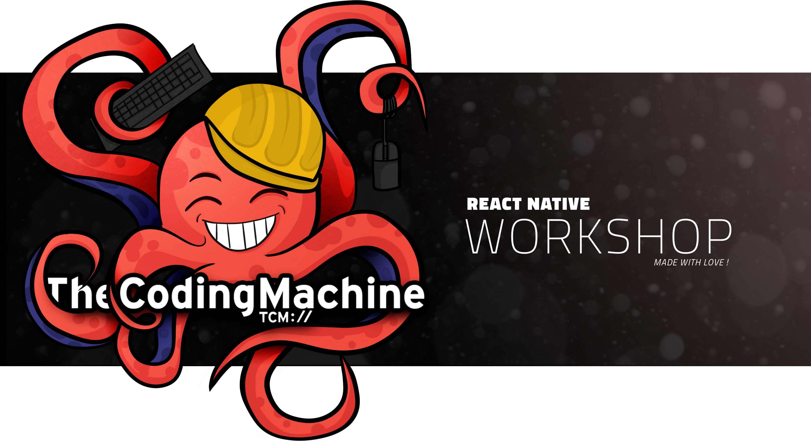

    
  

:waring: WORK IN PROGRESS :warning:

# TheCodingMachine React Native Workshop

This project is a [React Native](https://facebook.github.io/react-native/) workshop based on our [boilerplate](https://github.com/thecodingmachine/react-native-boilerplate).
In this specific project, we will provides code examples that can be implemented using our boilerplate and also specific UI components.

# Architecture

The architecture is the same as our [boilerplate](https://github.com/thecodingmachine/react-native-boilerplate).
So you have a good separation of concerns, state managed with Redux, the middleware Redux Saga and Axios for API calls.
For more information or details go to the boilerplate [documentation](https://github.com/thecodingmachine/react-native-boilerplate).

This application will follow this layout :

* `App/Assets`: assets (image, audio files, ...) used by the application.
* `App/Components`: presentational components
    * `Components\CodeExample\Examples`: contains components for the `Examples` section.
    * `Components\CodeExample\Animations`: contains components for the `Animations` section.
    * `Components\CodeExample\Experiments`: contains components for the `Experiments` section.
* `App/Config`: configuration of the application
* `App/Containers`: container components, i.e. the application's screens
    * `Containers\CodeExample\Examples`: provides code example that can be implemented using the boilerplate like The login screen.
    * `Containers\CodeExample\Animations`: contains simple or complex animations that can be used in a standard app.
    * `Containers\CodeExample\Experiments`: contains screen to make experimental components
* `App/Navigators`: react navigation navigators
* `App/Sagas`: redux sagas
    * `Sagas\CodeExample\Examples`: Stores related to `Examples code` section.
    * `Sagas\CodeExample\Animations`: Stores related to `Animations` section.
    * `Sagas\CodeExample\Experiments`: Stores related to `Experiments` section.
* `App/Services`: application services, e.g. API clients 
* `App/Stores`: redux actions, reducers and stores
* `App/Theme`: base styles for the application

# Content
In this app you will find these 3 sections :
* **Examples code**: 
    * A simple demo of an API call with error handling with redux, redux saga and axios
    * A session login implementation
* **Experiment**:
    * The utilisation of 
    * The utilisation of react-native-community/react-native-linear-gradient to see what is possible to do
    * Navbar with extra central button
* **Animations**:
    * create input animation :
        * bounce enter
        * shake if error

# Requirements

Node 8 or greater is required. Development for iOS requires a Mac and Xcode 9 or up, and will target iOS 9 and up.

You also need to install the dependencies required by React Native:
* for Android development
* for iOS development

# License

This project is released under the [MIT License](LICENSE).

# About us

[TheCodingMachine](https://www.thecodingmachine.com/) is a web and mobile agency based in Paris and Lyon, France. We are [constantly looking for new developers and team leaders](https://www.thecodingmachine.com/nous-rejoindre/) and we love [working with freelancers](https://coders.thecodingmachine.com/). You'll find [an overview of all our open source projects on our website](https://thecodingmachine.io/open-source) and on [Github](https://github.com/thecodingmachine).